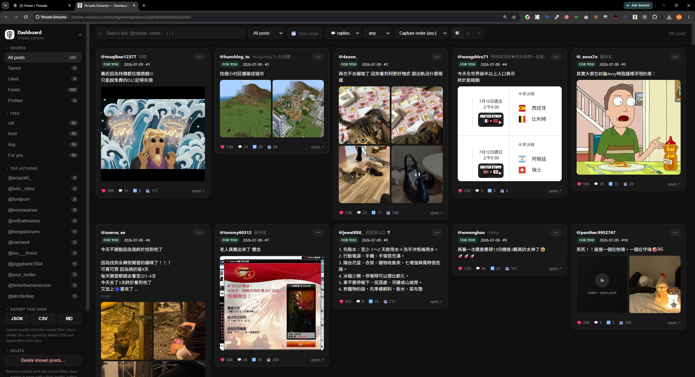

# Threads Extractor

A personal MV3 Chrome extension that grabs **your own** [Threads](https://www.threads.com)
data — saved posts, feeds, and profiles — and gives you a local dashboard to
browse, filter, and export all of it. Everything runs inside your browser:
no backend, no accounts, no analytics, and nothing ever leaves your machine.

> Personal-use tool. It reads data your logged-in session can already see,
> through deliberately throttled scrolling of Threads' own pages. Meta's
> internal GraphQL shapes drift over time, so expect occasional breakage —
> see the re-discovery notes in the extension README.

## What it does

**Grab**

- **Saved posts** — auto-scrolls `threads.com/saved` to the end and captures
  every bookmarked post (capture is passive too: anything that loads on
  /saved is kept).
- **Feeds** — the top N posts of any feed (For you / Following / Ghost posts
  / your custom feeds / community feeds), either **one by one** (any number
  of feeds, navigated in turn) or **in batch**: feeds opened side by side as
  board columns and grabbed **in parallel**, 4 at a time in waves until every
  selected feed is done, with per-feed attribution from GraphQL request
  variables. The extension opens the columns itself and removes the ones it
  added when each wave ends.
- **Profiles** — anyone's public threads and replies (replies include the
  full parent post being replied to).
- **Search results** — type any query (or let the popup pick up the search
  already open in your Threads tab) and capture its results from
  `threads.com/search`. All three serp tabs are supported: **Recent**
  (default, paginates chronologically), **Top**, and **Profiles** (matching
  accounts — handle, name, bio, follower count — exported as their own CSV).
  Each result is tagged with the query, different queries accumulate, and
  re-grabbing a query replaces its earlier snapshot. The popup keeps a
  search history for one-click re-runs, and any search can be
  **bookmarked** (★ next to the query box, or from the history list) into a
  saved-searches checklist — tick the ones you want and grab them all in one
  run: **in batch**, opened side by side as board search columns 4 at a time
  in waves (like feeds), or **one by one** on the /search page. Each batch
  run first sweeps leftover search columns (from interrupted runs) off the
  board so columns never pile up, and removes its own when done. Power-search
  filters (**After date / Before date / From profile** chips, and tag serps)
  are detected from the open tab, shown on the form, and preserved through
  bookmarks, history, and batch re-runs. Board columns can only express the
  Top/Recent tabs, so account searches and power-filtered searches
  automatically run one by one after the waves finish.
- Every post records author, text, media URLs, like count, **reply count**,
  posted time, capture order, and — where a thread arrives as a
  conversation preview — the full `replyTo` parent.

**Browse** (dashboard)

- Full-page dashboard reading the extension's storage live — no export step,
  updates while a grab is running.
- Facets for source / feed / profile / author, full-text search, media and
  minimum-reply-count filters, sorting by capture order, date, likes, or
  replies.
- Three layouts: grid, list, and a Reddit-style **compact** view.
- Windowed virtualization keeps thousands of posts scrolling smoothly.
- **Who liked this** — from any card's ⋯ menu, fetch the full list of accounts
  that liked (or reposted) that post on demand, shown inline with a
  copy-handles button. Pages through the whole list newest-first (needs a
  threads.com tab open); very large lists stop at a safety cap.

**Export / Import**

- JSON / CSV / Markdown exports from the popup (per source) or from the
  dashboard (**exactly what the current filters show**).
- **Import** earlier JSON exports back in via the dashboard — exports double
  as backups. Duplicates are skipped; imported feed posts survive future
  runs.
- **Delete this view** from the dashboard: remove exactly the posts the
  current filters show (a feed, a profile, an author, a date range, a
  search), two-click confirmed — finer control than the popup's per-tab
  Clear buttons.

## Install

**From the Chrome Web Store:**
[Threads Extractor](https://chromewebstore.google.com/detail/threads-extractor/ljibcmgickjolhnjcmihoocelmlfofkl)

**Or unpacked, from source:**

1. Clone this repo
2. Open `chrome://extensions`, enable **Developer mode**
3. **Load unpacked** → select the [`threads-extractor/`](threads-extractor/) folder

Then open threads.com, click the extension icon, and grab something — hit
**Dashboard ↗** in the popup header to browse it.

Chrome 111+ required. Keep the Threads tab **visible** during grabs — Threads
pauses feed loading in hidden tabs (a small dedicated window in a screen
corner works fine).

## Repo layout

| Path | What |
| --- | --- |
| [`threads-extractor/`](threads-extractor/) | the extension — full docs, architecture, and GraphQL discovery notes in its [README](threads-extractor/README.md) |
| [`PRIVACY.md`](PRIVACY.md) | privacy policy (also linked from the Web Store listing) |
| `images/screenshot/` | screenshots and Web Store listing assets |
| `threads-saved-extractor-brief.md` | the original project brief |

## Privacy & caveats

- All data stays in `chrome.storage.local`; the only outputs are the export
  files you download. Full policy: [PRIVACY.md](PRIVACY.md).
- Media are stored as URLs only — Meta's signed CDN links expire after a few
  days, so download anything you want to keep soon after export.
- Chrome ties an unpacked extension's storage to its folder path: renaming or
  moving the folder resets the store. Export first (and re-import after).
- Keep it personal and low-volume; this is not a scraping framework.

## License

[MIT](LICENSE)
